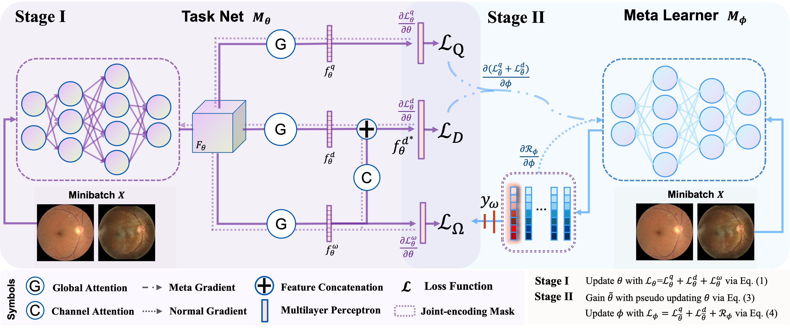

# Image Quality-aware Diagnosis via Meta-knowledge Co-embedding (CVPR2023)

## Introduction
Medical image-based disease diagnosis plays a vital role in modern healthcare, assisting medical professionals in detecting and analyzing various diseases. 
However, the quality of medical images can significantly impact the accuracy and reliability of disease diagnosis. 
Image quality may vary due to factors such as noise, motion artifacts, or inconsistencies in the imaging process. 
The Image Quality-Aware Disease Diagnosis (IQAD) addresses this challenge by incorporating image quality assessment into the disease diagnosis process, aiming to enhance the overall effectiveness of medical image-based diagnosis systems.
By incorporating image quality assessment, the model can adapt its predictions according to the image quality, potentially reducing false positives and false negatives. 
This leads to more accurate and reliable diagnosis results, which in turn could contribute to better patient care and treatment outcomes.

To tackle the IQAD problem, we propose the Meta-knowledge Co-embedding Network (MKCNet), an innovative approach that correlates image quality and disease diagnosis through the collaboration of two subnets: Task Net and Meta Learner. 
Task Net is designed to construct knowledge co-embedding features while explicitly exploring their potential usefulness in improving diagnosis. 
It employs the Global Attention Block (GAB) to extract task-specific features and the Meta-knowledge Assistance Block (MAB) to explicitly explore the potential benefits of these features in diagnosis.
On the other hand, Meta Learner is designed to optimize Task Net's co-embedding features using meta-learning techniques. 
By providing beneficial auxiliary labels, Meta Learner helps Task Net to optimize its knowledge co-embedding features effectively. 
This iterative process leads to an end-to-end interaction between the two subnets, resulting in a model that can adapt to variations in image quality and provide more accurate disease diagnosis.

<p align="center">
  
</p>

## Getting Started
These instructions will help you set up and run the project on your local machine for training and testing purposes.

### Data Preparation

#### 1. Download the dataset

This project involves eight medical image datasets:

- **DRAC**: Please download this dataset from [here](https://drac22.grand-challenge.org/Data/).

- **DEEPDR**: Please download this dataset from [here](https://github.com/deepdrdoc/DeepDRiD).

- **EYEQ**: Please prepare this dataset follow the instruct [here](https://github.com/HzFu/EyeQ).

- **IQAD-CT**: This dataset is combined from [COVID-CT-Dataset](https://github.com/UCSD-AI4H/COVID-CT) and [SARS-COV-2 Ct-Scan Dataset](https://www.kaggle.com/datasets/plameneduardo/sarscov2-ctscan-dataset).

- **IQAD-CXR**: This dataset is re-sampled from [Child Chest X-ray Images](https://data.mendeley.com/datasets/rscbjbr9sj/3) with CC BY 4.0 license, and [NIH Chest X-rays](https://www.kaggle.com/datasets/nih-chest-xrays/data) with CC0 license. For convenience, we provide post-processed images [here](https://hkustconnect-my.sharepoint.com/:u:/g/personal/hche_connect_ust_hk/EU1ycYqnte9CteECai2O77kB-5rDpScYA14tXHYD_gBLew?e=UlLkV1), following their license permission carefully.

#### 2. Prepare the dataset split and labels

We provide the dataset split in `./dataset_splits/`. Please note that we use the original data splits for DEEPDR and DRAC, and ramdomly split the data for EYEQ, IQAD-CT, and IQAD-CXR.
The split file is a text file with each line containing the image path, diagnosis label and image quality label, e.g.,

```
Images/image1.png,0,0
```

#### 3. Organize the dataset

The dataset should be organized as follows:

```
YOURDATASET/
├── DATASET1/
│   ├── Images/
│   │   ├── image1
....
│   │   ├── imageN
│   ├── train.txt
│   ├── val.txt
│   ├── test.txt

├── DATASET2/
....
```

### Trained Weight
To help for evaluation, we provide our pre-trained weights. You can find them [here](https://hkustconnect-my.sharepoint.com/:f:/g/personal/hche_connect_ust_hk/EraJ0oKPGANBsb0fcemdLFcBrzXiAd6dBBS6UYLtfdzg9g?e=BsXGba).


### Train from the Scratch
We provide two kind of MKCNet models, i.e., MKCNet and MKCNet with first order acceleration. To train the MKCNet model, please run the following command:
```python
python main.py --dataset YOUR_DATASET --model MKCNet --output YOUR_OUTPUT_DIR
```
To train the MKCNet with first order acceleration model, please run the following command:
```python
python main.py --dataset YOUR_DATASET --model FirstOrder_MKCNet --output YOUR_OUTPUT_DIR
```

Please note that you can also specify the hyper-parameters for training by designing your onw config file in `./configs/`.

Currently, we support the following models (with VGG16 backbone) in our code repository:
- VanillaNet 
- CANet 
- MKCNet
- FirstOrder_MKCNet 
- DETACH 

### Evaluation
We ensemble the tensorboard analysis during training, and you can find the results from tensorboard or the log file in `YOUR_OUTPUT_DIR/`.
For DRAC, please evaluate your model on [their official website](https://drac22.grand-challenge.org/Evaluation/).

## Citation

```
@inproceedings{che2023image,
  title={Image Quality-aware Diagnosis via Meta-knowledge Co-embedding},
  author={Che, Haoxuan and Chen, Siyu and Chen, Hao},
  booktitle={Proceedings of the IEEE/CVF Conference on Computer Vision and Pattern Recognition},
  pages={19819--19829},
  year={2023}
}
```

## Comments from Chat-GPT4 (Just for Fun)

This work introduces an innovative approach called MKCNet (Meta-knowledge Co-embedding Network), which aims to tackle the Image Quality-aware Disease Diagnosis (IQAD) problem. The MKCNet achieves the correlation between image quality and disease diagnosis through the collaboration of two subnets, namely Task Net and Meta Learner.

The design philosophy of the Task Net holds significant research value, particularly in the innovations of the Global Attention Block (GAB) and Meta-knowledge Assistance Block (MAB). These modules help extract information related to disease diagnosis and image quality and effectively combine them. Additionally, by employing the concept of meta-learning, the Meta Learner is capable of providing beneficial auxiliary labels to Task Net, optimizing the co-embedding features.

The experimental results demonstrate significant performance improvements on multiple datasets, which suggests that MKCNet effectively addresses the IQAD problem. Moreover, the IQAD problem is of great importance as it has a direct impact on the accuracy and reliability of disease diagnosis based on medical imaging. By considering image quality in the diagnosis process, the proposed method can potentially enhance the overall effectiveness of medical image-based diagnosis systems.